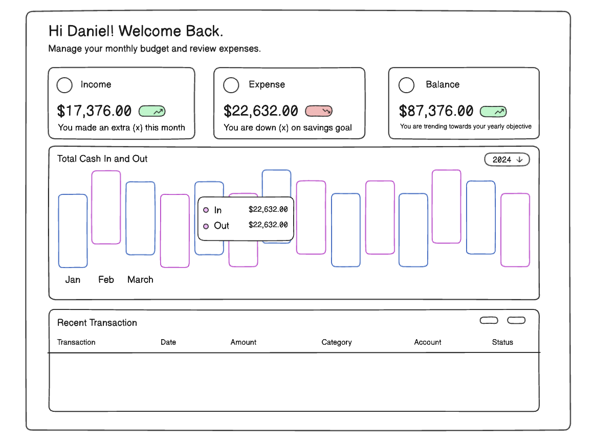

# React Superbudget PWA
A Progressive Web Application (PWA) built with React for effective budget management.

## Technologies Used
- React
- Typescript
- Tailwind
- Node.js
- SQL
- Vite
- Docker
- Eslint

### Versions
#### v.1.0.0
- Enables users to create a budget spanning a period of 12 months
- Allows users to add incomes and expenses to each budget and view live calculations of totals
- Provides the option for users to randomly seed a budget for demonstration purposes

#### v.2.0.0 
- Re-designed the UI to be simple, modern, and user-friendly. Users can easily navigate through all aspects of the application from the dashboard.
- Migrate to a React-Vite application skeleton with TypeScript and Tailwind CSS.
Refactored the codebase to adhere to React Atomic Design principles.
- Develop backend services for providing data persistance and tailored user account experience

#### Features:
- User Account System
- Add/view Income for entire year and/or selected month
- Add/view Expenses for entire year or selected month
- Add/view balance of accounts
- View list of recent transactions filterable by type

### Screenshot

